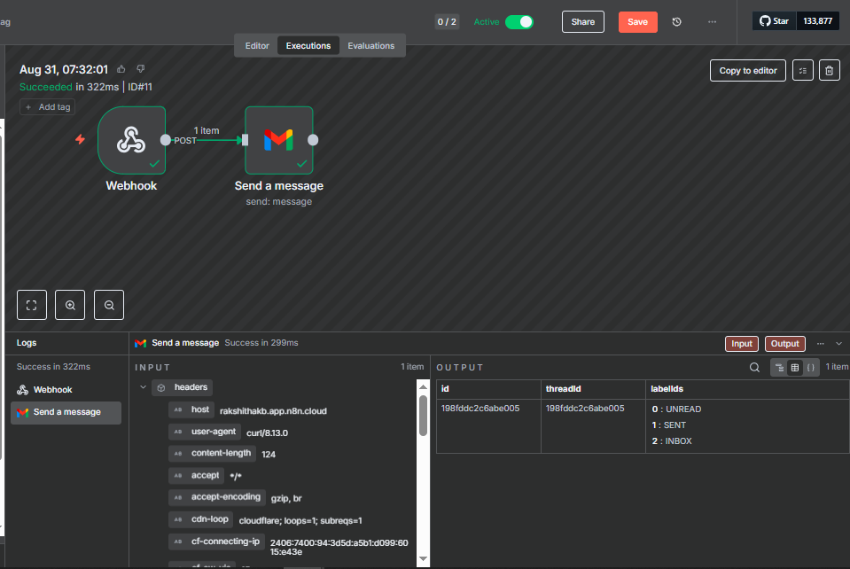
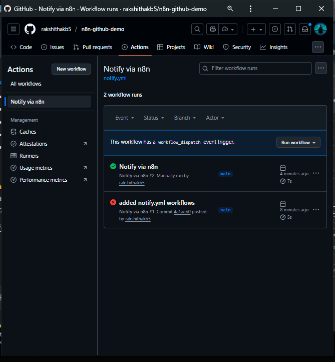
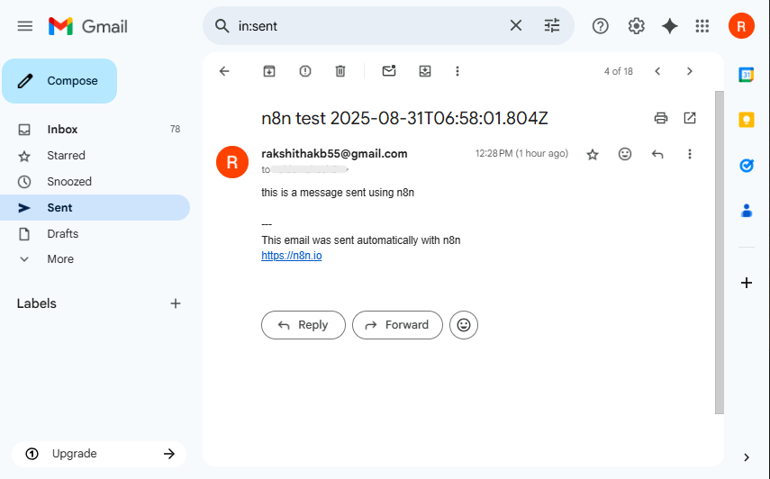

# 🚀 n8n GitHub → Gmail Demo

---

##  Prereqs

```bash
# Make a folder and open it in VS Code (or your editor)
mkdir n8n-github-demo && cd n8n-github-demo
git init
```
---
## 1. n8n Workflow (what to build)
Webhook  (POST /send-gmail, Production URL)
   → Gmail (Send)

Gmail node fields (Expressions with fallbacks):
To:   {{$json.to || "naidumahesh5@gmail.com"}}
Subject:  {{$json.subject || ("n8n test " + new Date().toISOString())}}
Message:  {{$json.message || "this is a message sent using n8n"}}
Email type: Plain text

```bash
# Test your Production URL from Windows CMD
curl -X POST "https://<your-n8n-host>.n8n.cloud/webhook/send-gmail" -H "Content-Type: application/json" -d "{\"to\":\"naidumahesh5@gmail.com\",\"subject\":\"Prod test\",\"message\":\"this is a message sent using n8n\"}"

# Test from PowerShell
curl -Method POST "https://<your-n8n-host>.n8n.cloud/webhook/send-gmail" -Headers @{ "Content-Type"="application/json" } -Body '{"to":"naidumahesh5@gmail.com","subject":"Prod test","message":"this is a message sent using n8n"}'
```

## 2. Repo structure 
.github/
  workflows/
    notify.yml
README.md   
### Create folders/files:
```bash 
mkdir -p .github/workflows
```

## 3. Github actions workflow
Path: .github/workflows/notify.yml

## 4. Add the secret (in github ui)
Repo → Settings → Secrets and variables → Actions → New repository secret
Name: N8N_WEBHOOK_URL
Value: https://<your-n8n-host>.n8n.cloud/webhook/send-gmail

## 5. First commit and push
```bash
git add .
git commit -m "Add n8n webhook notifier"
# If your branch is master, rename to main (recommended)
git branch -M main
git remote add origin https://github.com/rakshithakbfive/n8n-github-demo.git
git push -u origin main
```

## 6. Run the action

GitHub → Actions → "Notify via n8n" → Run workflow
#### or push another commit; the workflow triggers on push to main

## 7. Verify delivery

n8n → Executions: Webhook → Gmail should be green
Gmail (sender: rakshithakb55@gmail.com) → Sent
Gmail (receiver: naidumahesh5@gmail.com) → Inbox / All Mail / Spam / Promotions

## 8. Badge
```markdown


```

## 9. 📸 Demo Screenshots

### A. Successful n8n Execution


### B. GitHub Action Workflow Run


### C. Email Delivered in Gmail Inbox


---

## 10. Troubleshooting(quick)

A. "src refspec main does not match any"
   → You have no commits yet. Do:

    ```bash

    git add . && git commit -m "init"

    ```
    then push.

B. "Can't push refs. Pull first."
   → Repo had an initial commit (README). 
   Run:
   ```bash
      git pull origin main --allow-unrelated-histories
      git push -u origin main
```

C. Action is green but no email
   → Use unique subject (ISO timestamp).
   → Check Gmail All Mail / Spam / Promotions.
   → Verify Gmail node uses expressions (To/Subject/Message).
   → Sender account is the Gmail credential in n8n.

#### Error: Can't push refs. Pull first.

### ➡️ GitHub repo had a README/.gitignore. 
Run:
```bash
git pull origin main --allow-unrelated-histories
git push -u origin main

```
### Action green but no email
```markdown
➡️ Use a unique subject with timestamp.
➡️ Check Gmail “All Mail” / Spam / Promotions.
➡️ Ensure Gmail node has expressions (to/subject/message).
➡️ Confirm Gmail credential is correct (sender account).
```
---
## ✅ Next Steps
Add more GitHub events as triggers (issues, PRs, releases).

Enhance Gmail node to send HTML templates instead of plain text.

Add a BCC field (e.g. to sender) to always get proof of delivery.

Store Gmail node’s JSON output (id, threadId) as an artifact in GitHub Actions for debugging.


---

## 📜License
This project is licensed under the MIT License.


